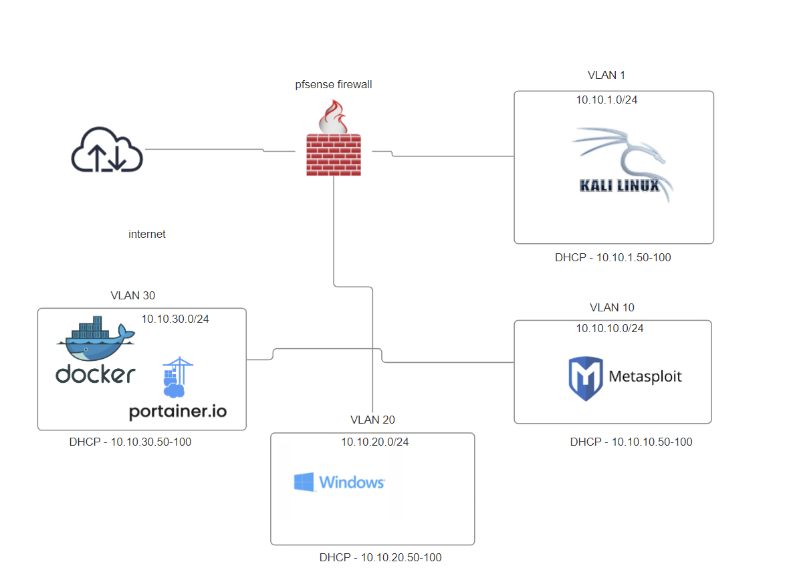
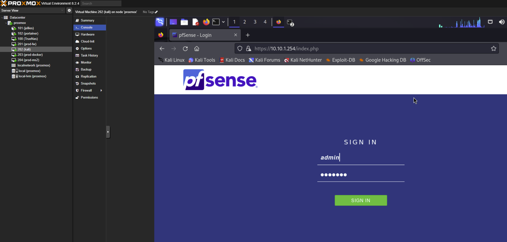
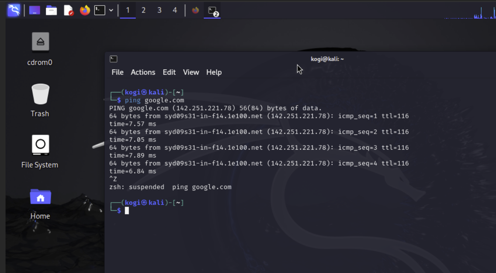
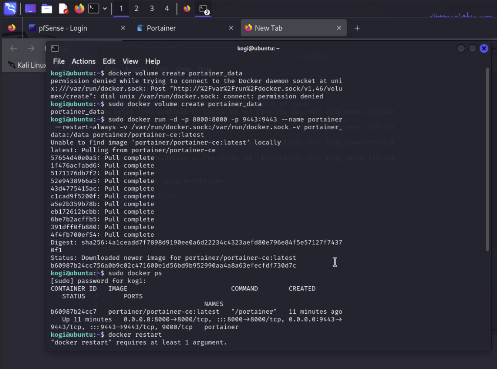
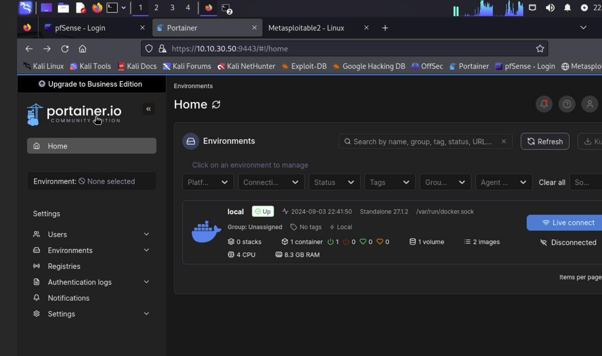
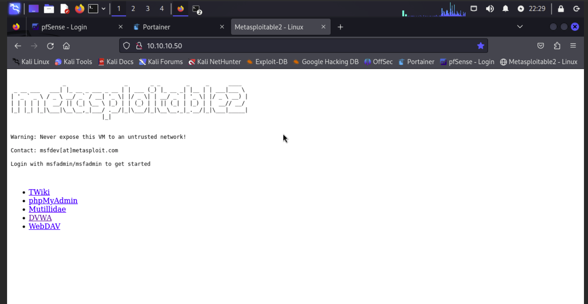

# Lab Setup Instructions

Welcome to the setup guide for the Cybersecurity Lab Portfolio. This document provides instructions for configuring your lab environment with pfSense, Kali Linux, Docker, and Metasploitable 2.

## Table of Contents

- [Plan](#plan)
- [Setup Overview](#setup-overview)

## Plan
### Architecture 

*installing in a seperate area within my home server through Proxmox*

1. installing **pfSense Firewall**
2. **Kali Linux** for managing the firewall and conducting attacks
3. **Docker and Portainer** for running vulnerable applications
4. **Metasploitable 2** as a vulnerable machine

## Setup Overview

1. **Configure pfSense Firewall**

   - **Purpose:** Control and monitor all traffic within your lab network.
   - **Instructions:** Follow pfSense documentation to set up basic configurations such as interfaces, firewall rules, and NAT.
       1. obtain pf sense iso from website
       2. create a vm and install
#### pfSense Configuration

2. **Install Kali Linux**

   - **Purpose:** Use Kali Linux as the main attack machine and for managing the pfSense firewall.
   - **Instructions:** Ensure Kali Linux is properly networked with pfSense and other lab components.
       1. obtain kali iso from Kali website
       2. create a vm and install
       3. test connection to internet
#### Kali Linux Test

3. **Set Up Docker for Vulnerable Applications**

   - **Purpose:** Use Docker to run vulnerable applications and services.
   - **Instructions:** Install Docker and pull the necessary vulnerable images.
        1. create the Docker VM in proxmox
        2. ssh into docker vm through kali
        3. install portertainer as a docker container
        4. manage portainer through port :9449
#### Portainer

  
4. **Install Metasploitable 2**
   - **Purpose:**  A premade vulnerable machine to understand and exploiting common vulnerabilities.
   - **Instructions:** Ensure Kali Linux is properly networked with pfSense and other lab components.
       1. create a vm without an image
       2. ssh into proxmox, locate the vm files and add the iamge to the configuration files
       3. start the vm and finish configuration
       4. test the finished install from the Kali machine
#### Metasploitable 2 Web Test

